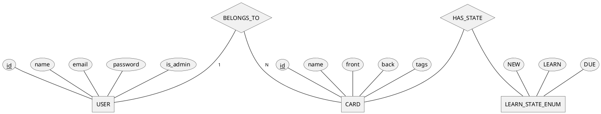
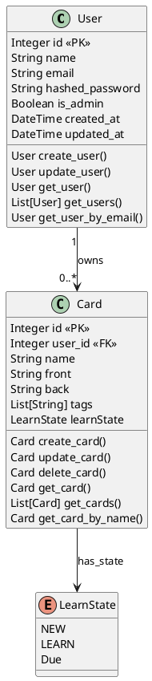

```plantuml
@startchen

entity USER {
  id <<key>>
  name
  email
  password
  is_admin
}

entity CARD {
  id <<key>>
  name
  front
  back
  tags
}

entity LEARN_STATE_ENUM {
  NEW
  LEARN
  DUE
}

relationship BELONGS_TO {
}

relationship HAS_STATE {
}

BELONGS_TO -1- USER
BELONGS_TO -N- CARD
HAS_STATE -- LEARN_STATE_ENUM
HAS_STATE -- CARD

@endchen
```

```plantuml
@startuml

class User {
  Integer id <<PK>>
  String name
  String email
  String hashed_password
  Boolean is_admin
  DateTime created_at
  DateTime updated_at

  User create_user()
  User update_user()
  User get_user()
  List[User] get_users()
  User get_user_by_email()
}

class Card {
  Integer id <<PK>>
  Integer user_id <<FK>>
  String name
  String front
  String back
  List[String] tags
  LearnState learnState

  Card create_card()
  Card update_card()
  Card delete_card()
  Card get_card()
  List[Card] get_cards()
  Card get_card_by_name()
}

enum LearnState {
  NEW
  LEARN
  Due
}

User "1" --> "0..*" Card : owns
Card --> LearnState : has_state

@enduml
```